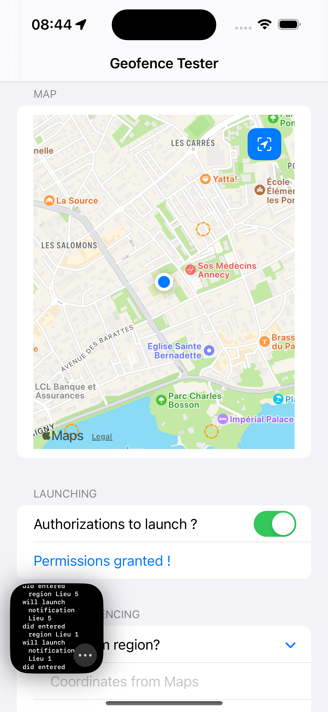
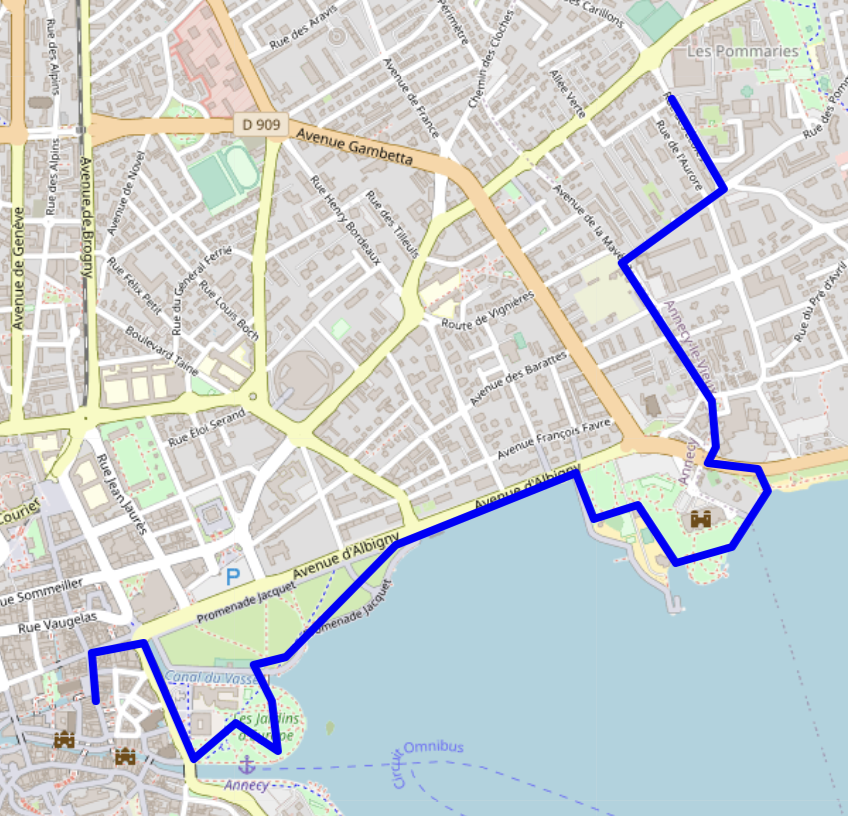

# Geofencing with SwiftUI

This project is a sample that use SwiftUI and CoreLocation to make a geofence app.

I also use .gpx file to simulate a given itinerary to test geofence.

## Features
* MapKit
* Geofencing with CoreLocation
* Local notification using Combine being triggered when entering fences

